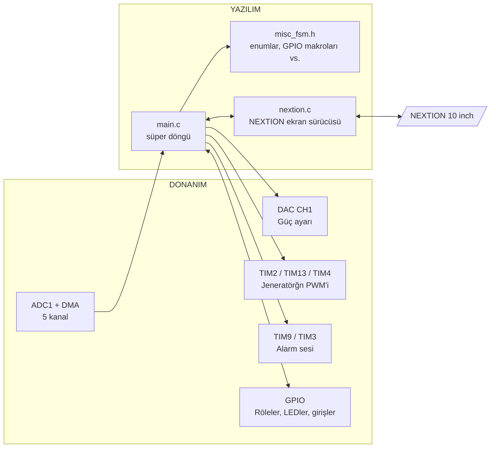

# GENX-400HF-L Koter Cihazı İçin Yazılım Dokümantasyonu

## 1. Genel Bakış

Bu yazılım, üç farklı çıkış türüne sahip bir elektrokoteri kontrol eder:

| Kanal | Mod | Açılma kaynağı |
| --- | --- | --- |
| **Mono1** | Cut (CUT, BLEND1–3, RESECTION1/2, POLYPECTOMY, PAPILLOTOMES), Coag (CONTACT, SPRAY1–3, FULGURATION) | El aleti yada çift pedal üzerindeki anahtar |
| **Mono2** | Cut (CUT, BLEND1–3, RESECTION1/2, POLYPECTOMY, PAPILLOTOMES), Coag (CONTACT, SPRAY1–3, FULGURATION) | El aleti yada çift pedal üzerindeki anahtar |
| **Bipolar1** | Cut (CUTTING, SCISSORS, BIVAPO, BIREZO), Coag (STANDARD, FORCED, STOP, START, (+ "5" = auto-stop?)) | Çift Pedal, tek pedal (koagülasyonda), Hand |
| **Bipolar2 (Seal / LigaSure)** | Cut, Coag (LIGATION, SEALSURE, TISSUELOCK) | Çift/Tek pedal, Hand |

Operatör arayüzü **NEXTION** ekranıdır. USART3, 230400 baud, PB10 (47)/PB11 (48) pinleri üzerinden bağlıdır. Modların ayarları ekranın kendisinde (EEPROM değişkenlerinde) saklanır ve sistem başlatıldığında okunur.

Mimari **tek bir süper döngüden** oluşmaktadır. Fonksiyonlar periyodik olarak çağrılır ve donanım doğrudan HAL katmanından kontrol edilir (**NEXTION** sürmesi hariç).

## 2. Çevre birimleri

Saat: HSE, PLL -> SYSCLK 168 MHz, APB1/APB2 = HCLK/4, bu nedenle zamanlayıcılar 84 MHz'de çalışır (TIM9, APB2'de bulunan 168 MHz'de çalışır). Aşağıdaki frekanslar, koddaki `PSC` ve `Period`'dan hesaplanır:

| Çevre birimi | Amaç | Parametreler |
| --- | --- | --- |
| **ADC1** (DMA2 Stream0, circular, 12 bit) | `gAdc1DmaBuff[5]` | aşağıdaki tablodadır |
| **DAC CH1** (8 bit) | `dacVeri` - Çıkış gücü ayarı | `HAL_DAC_SetValue()` aracılığıyla yazılır |
| **TIM13** CH1 | \~**400 kHz** taşır (PSC 21, ARR 10) | Herhangi MONO- çıkışında aktif edilir |
| **TIM2** CH1 | \~**33 kHz** PWM, `Compare` görev döngüsü | CUT modunda: [yok]; BLEND1/2/3 modlarında: [212/160/127]; COAG modlarında: [108/20/22/24] |
| **TIM4** CH1 | Bipolar PWM \~**500 kHz** | Compare = 4 |
| **TIM9** CH2 | Ses, `PSC` aracılığıyla tonu değiştirilir | Frekansı \~1,3 kHz |
| **TIM3** CH1 | Plate alarm sesi | Pariyodu 21000x2600​/84000000 = 0.65s |
| **TIM5** (kesme) | Endocut tik, **10 ms** (PSC 24000, ARR 35) | `HAL_TIM_PeriodElapsedCallback()` |
| **TIM14** CH1 | RF modülü 40 kHz | TODO |
| **USART1** | - | - |

### 2.1. ADC Kanalları (`gAdc1DmaBuff`)

| İdx | Kanal | Amaç | Nerede kullanılmakta |
| --- | --- | --- | --- |
| `[0]` | CH0 | Monopolar çıkış gücü (`monoGuc`) | **Monopolar cut** korumada, 100 wattlık start |
| `[1]` | CH1 | Plate endüktansı (`plateOhm`) | Patient Plate kontrolünde |
| `[2]` | CH2 | Yüksek gerilim değeri (`highVolt`) | BIST ve korumada |
| `[3]` | CH3 | Bipolar çıkış gücü (`ligasureWattYaz`, `bipolarCutWattYaz`) | güç değer düzeltmeleri, auto-stop |
| `[4]` | CH8 | boşta | — |

### 2.2. Kullanılan Ana GPIO'lar

| Pin | Türü | Amacı |
| --- | --- | --- |
| PB8 (95) / PB4 (90) | Giriş | Mono1 el aleti Cut / Coag |
| PB7 (93) / PB5 (91) | Giriş | Mono2 el aleti Cut / Coag |
| PE9 (40) / PE10 (41) | Giriş | Çift pedal Cut / Coag (bütün kanallar için ortak, kanal seçimi `mono1Pedal` vs. ile yapılır) |
| PC1 (16)| Giriş | Bipolar tek pedal / Hand |
| PD0 (81)| Çıkış | Hand röle. SET konumu Hand/Start anlamına gelir |
| PD11 (58)| Çıkış | Mono/Bipolar röle (RESET = mono, SET = bipolar) |
| PD8 (55)| Çıkış | Power On rölesi |
| PD1 (83) / PD3 (84) | Çıkış | Mono1 / Mono2 rölesi |
| PC4 (33) | Çıkış | Monopolar çıkış koruma |
| PC13 (7) | Çıkış | Bipolar CUT/COAG rölesi  |
| PC11 (79) | Çıkış | Spray röle |
| PD2 (83), PD6 (87), PD7 (88) | Çıkış | LigaSure röle (SET iken röle ON konumundadır)|
| PA8 (67), PA11 (70), PA12 (71)| Çıkış | CD4051 multiplexer (ölçüm devresi seçimi) |
| PB14 (53), PD10 (57)| Çıkış | 74LS (bipolar rölesi) |
| PD9 (56)| Çıkış | Fan |
| PE2 (1) / PC2 (17)| Çıkış | PWM sinyal çıkışları |
| PE3, PB1, PE7, PE8 | Çıkış | Sesin seviye ayarları |
| PE11 (42) / PE12 (43)| Çıkış | Patientplate LEDleri |
| Kanalların LEDleri | Çıkış | Mono1: PC7 beyaz, PD14 sarı, PB13 mavi. Mono2: PD13, PB15, PB12. Bipolar: PE14, PE15, PE13 |

## 3. `main()` süper döngüsü

